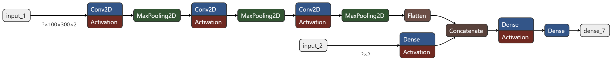

# DeepLearWing

## Introduction

This project uses a Convolutional Neural Network (CNN) to predict the lift, drag and moment coefficients of 2D airfoils. The model is trained on a dataset of 1600 airfoils, which geometry and aerodynamics performances were scraped from [Airfoil Tools](http://airfoiltools.com/). 

## Deep Learning for Aerodynamics

In aerodynamics, deep learning is a relevant tool to complement CFD simulations and enrich results analysis, via the following aspects:

* **Handling High-Dimensional Data**
Aerodynamics simulations involve complex interactions between airfoils, turbulence, and other non-linear factors. Deep learning models can effectively handle this complexity by learning patterns and relationships in the data. This allows to capture subtle effects that may not be easily captured by traditional methods.

* **Scalability**
Deep learning models can be trained on large datasets, making them well-suited for large-scale aerodynamics simulations. This scalability allows to predict aerodynamics performances for a wide range of airfoils and operating conditions, without the need for extensive computational resources.

* **Flexibility**
Deep learning models can be designed to accommodate different types of data, including numerical simulations, experimental data, and even physical laws (via PINNs). This flexibility allows to integrate multiple sources of information and deliver more reliable results.

* **Integration with CFD Simulations**
Deep learning models can be used to augment and refine CFD simulations, providing a hybrid approach that leverages the strengths of both methods. By combining the physical insights from CFD simulations with the predictive power of deep learning, one can create a more accurate and efficient approach for aerodynamics predictions.

* **Reduced Computational Cost**
Deep learning models can be trained on a subset of the data and then used to make predictions on new, unseen data. This reduces the computational cost of simulations to make predictions more quickly and efficiently.

## Dataset

The dataset was scraped from [Airfoil Tools](http://airfoiltools.com/). This online public repository gathers airfoil data created using XFOIL, a program for design and analysis of subsonic airfoils. The scraped data consists of 1600 airfoils, each represented by its:

* Geometry: 2D coordinates of the airfoil shape
* Aerodynamics performances: lift, drag and moment coefficients (respectively Cl, Cd and Cm)

For each airfoil, these performances are given for a range of Reynolds numbers (from 50 000 to 1 000 000) and angles of attack (from -10 to +10 deg for most airfoils) resulting in 800k+ samples. The dataset can be found on [Kaggle](https://www.kaggle.com/datasets/victorienmichel/deeplearwing)

## Preprocessing

### Airfoil images set

An image of each airfoil is generated from a set of XY coordinates. These coordinates define the airfoil's shape, and the image creation process involves plotting these points and filling the resulting outline to produce a visual representation of the airfoil profile.

### Image treatment

The images have a resolution of 300 by 100 pixels. This low resolution causes pixelation of the airfoil surfaces, which are then smoothed using Gaussian blur. Subsequently, the curvature of the surfaces is calculated. A heatmap is then generated, highlighting the areas of maximum curvature along the airfoil.

The pixelation still noticeably impedes the curvature calculation, which is why Gaussian blur is also applied to the heatmap. This additional smoothing helps reduce the artifacts caused by the low-resolution images.

### Image channels

To evaluate the impact of incorporating a curvature heatmap into the model, two types of images are used as input for the CNN. The first type consists of a single-channel image, where pixel values represent the airfoil shape. The second type includes an additional channel that represents the curvature heatmap. This approach allows for a comparative analysis of the model's performance with and without the curvature information.

### Average airfoil 

From the entire dataset, an average airfoil shape can be calculated to represent the typical profile across all samples. This average shape is derived by computing the mean value for each pixel across all the airfoil images in the dataset. The resulting composite image provides a visual representation of the most common features and characteristics shared among the airfoils in the dataset.

This average shape offers several insights:
* It illustrates the general characteristics of the airfoils in the dataset, such as the typical thickness distribution, camber, and leading edge radius.
* It can serve as a reference point for comparing individual airfoils within the dataset, helping to identify those with unusual or extreme features.
* It may reveal biases or trends in the dataset, such as a preference for certain airfoil families or design philosophies.
* It can be used as a starting point for further analysis or design iterations, representing a 'baseline' airfoil that embodies the dataset's overall characteristics.

## Model Architecture

The model takes two types of inputs: an image and a vector containing normalized values of angle of attack and Reynolds number. The image is processed by a CNN, while the vector is processed by a feedforward neural network. The outputs from both neural networks are then concatenated and fed into another feedforward neural network, which produces the final predictions for the target values.

The model architecture is determined using Keras Tuner with the HyperBand algorithm, to determine hyperparameters such as:
* Number of convolution layers
* Number of dense layers
* Number of filters
* Kernel sizes
* Inclusion of batch normalization and dropout layers

## Evaluation

The model was evaluated on a test set of 2000 samples.
The ranges of values for these samples are:

| Target | Range |
| :---: | :---: |
| Cd | 0.0036 - 0.2185 |
| Cl | -1.3594 - 2.1463 |
| Cm | -0.2625 - 0.2555 |

### Single-channel images vs double-channel images

| | Single-Channel Images | Double-Channel Images |
| :---: | :---: | :---: |
| MSE | 0.0024 | 0.0021 |
| MAE | 0.0342 | 0.0310 |

Both MSE and MAE are lower for the Double-Channel Images, indicating improved model performance. The reduction in MSE represents a **12.5%** improvement. The reduction in MAE represents a **9.36%** improvement. The addition of the curvature heatmap (second channel) appears to provide valuable information to the model, resulting in more accurate predictions. The improvement is consistent across both error metrics, suggesting that the benefit is robust and not an artifact of a particular measurement approach. The relatively larger improvement in MSE compared to MAE might indicate that the additional channel helps reduce larger errors more effectively.

The mean absolute errors are:

| Target | Mean Absolute Error |
| :---: | :---: |
| Cd | 0.0106 |
| Cl | 0.1081 |
| Cm | 0.0153 |

Predicting lift values for airfoils is more complex than predicting drag in both traditional simulations and deep learning approaches due to lift's high sensitivity to small changes in flow conditions and airfoil geometry. Lift involves intricate flow phenomena like separation and boundary layer interactions, which are challenging to model accurately. The non-linear behavior of lift requires larger, more diverse datasets and sophisticated modeling techniques to capture multi-scale physics and temporal dynamics. Additionally, models struggle with extrapolation to extreme conditions and face interpretability challenges. These factors collectively make lift prediction a more demanding task, reflecting the fundamental complexity of lift forces in fluid dynamics and requiring more extensive validation across varied test cases.

